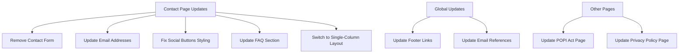
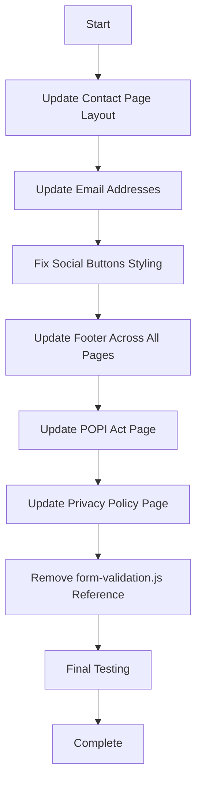

# Detailed Plan: Contact Page Updates and Email Changes

Based on my analysis and your feedback, I've created a comprehensive plan to implement all the requested changes. This plan will address removing the contact form, updating email addresses, fixing references to the form in FAQ sections, and resolving the mobile styling issue with social buttons.

## 1. Overview of Changes



## 2. Detailed Changes

### 2.1 Contact Page Updates

#### Remove Contact Form and Update Layout
- Remove the entire form container (lines 107-134)
- Switch to a single-column layout centered on the page
- Update the "Get in Touch" section to include all email addresses:
  - General inquiries: info@hambacompare.com
  - Partnership inquiries: partners@hambacompare.com
  - Complaints/feedback: complaints@hambacompare.com
- Remove the script tag that includes form-validation.js

#### Update FAQ Section
- Modify FAQ entries that reference the contact form:
  - Line 151: "I'm having technical issues with the website. What should I do?"
    - Change to: "Please email us at info@hambacompare.com with details about the issue you're experiencing. Screenshots are always helpful."
  - Line 156: "We currently handle all customer inquiries through our contact form and email."
    - Change to: "We currently handle all customer inquiries through email. This allows us to efficiently route your query to the right team member."
  - Line 161: "Please use the contact form and select "Partnership Inquiry" as the subject."
    - Change to: "Please email partners@hambacompare.com. Our partnerships team will get back to you promptly."

#### Fix Social Buttons Styling
- Modify the social buttons to be smaller on mobile but keep them on the same line
- Add responsive styling in the CSS:
  ```css
  @media (max-width: 767px) {
    .social-links .btn {
      padding: 0.5rem 0.75rem;
      font-size: 0.875rem;
    }
  }
  ```

### 2.2 Global Updates

#### Update Footer Links
- Change "Contact Form" link in the footer to "Email Us" across all pages
- Update the href to "mailto:info@hambacompare.com"

#### Update Email Addresses
- Change all email addresses from the .co.za domain to .com:
  - info@hambacompare.co.za → info@hambacompare.com
  - privacy@hambacompare.co.za → privacy@hambacompare.com

### 2.3 Other Pages Updates

#### POPI Act Page
- Update references to the contact form (lines 215, 259)
  - Line 215: Change "or use our Contact Form" to "or email us at privacy@hambacompare.com"
  - Line 259: Change "Contact Form" link to "Email: privacy@hambacompare.com"

#### Privacy Policy Page
- Update reference to the contact form (line 190)
  - Change "Contact Form" link to "Email: privacy@hambacompare.com"

## 3. Implementation Plan



### 3.1 Contact Page Implementation

1. **Remove Form and Update Layout**
   - Delete the form container div (lines 107-134)
   - Modify the features-grid class to use a single column layout
   - Update the "Get in Touch" section with all three email addresses
   - Add appropriate styling to maintain visual balance

2. **Update FAQ Section**
   - Modify FAQ entries to direct users to email instead of using the form
   - Update text to be clear about which email to use for different inquiries

3. **Fix Social Buttons**
   - Add responsive CSS for the social buttons to make them smaller on mobile:
   ```css
   @media (max-width: 767px) {
     .social-links .btn {
       padding: 0.5rem 0.75rem;
       font-size: 0.875rem;
     }
   }
   ```

4. **Remove Script Reference**
   - Remove the script tag that includes form-validation.js (line 222)

### 3.2 Global Updates Implementation

1. **Footer Updates**
   - Change "Contact Form" to "Email Us" in all HTML files
   - Update the href to "mailto:info@hambacompare.com"

2. **Email Address Updates**
   - Update all email addresses to use the .com domain

### 3.3 Other Pages Implementation

1. **POPI Act Page**
   - Update references to the contact form
   - Change to direct users to email privacy@hambacompare.com

2. **Privacy Policy Page**
   - Update reference to the contact form
   - Change to direct users to email privacy@hambacompare.com

## 4. Testing Plan

1. **Functionality Testing**
   - Verify all email links work correctly
   - Ensure no broken links remain to the contact form

2. **Responsive Testing**
   - Test the contact page on mobile devices to ensure no horizontal scrolling
   - Verify social buttons display correctly on all screen sizes

3. **Visual Testing**
   - Ensure the contact page maintains a balanced layout after removing the form
   - Verify styling is consistent across all pages

## 5. Files to Modify

1. **HTML Files**
   - contact.html
   - index.html
   - about.html
   - how-it-works.html
   - privacy-policy.html
   - popi-act.html

2. **CSS Files**
   - assets/css/responsive.css (add styling for social buttons on mobile)