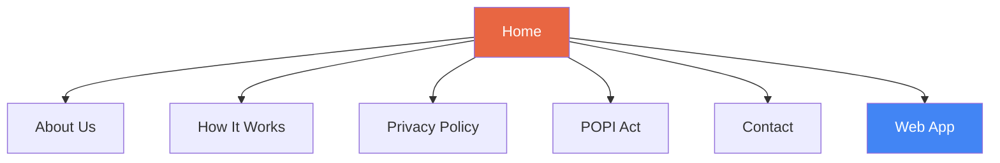
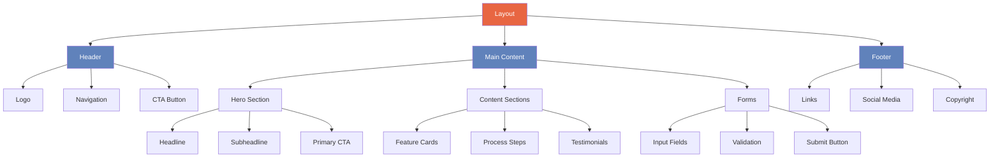

# Detailed Plan: Hambacompare Marketing Website

Based on our discussion and the requirements, here's a comprehensive plan for creating the Hambacompare marketing website. This will be a professional, responsive site built with HTML, CSS, and minimal JavaScript that matches the existing brand style shown in the screenshots.

## 1. Project Structure

```
hambawebsite-1/
├── index.html                  # Home page
├── about.html                  # About Us page
├── how-it-works.html           # How It Works page
├── privacy-policy.html         # Privacy Policy page
├── popi-act.html               # POPI Act compliance page
├── contact.html                # Contact page
├── assets/
│   ├── css/
│   │   ├── styles.css          # Main stylesheet
│   │   ├── responsive.css      # Responsive styles
│   ├── js/
│   │   ├── main.js             # Main JavaScript file
│   │   ├── form-validation.js  # Form validation script
│   ├── images/
│   │   ├── logo.svg            # Hambacompare logo
│   │   ├── icons/              # Insurance type icons
│   │   ├── hero-bg.jpg         # Hero section background
│   │   └── ...                 # Other images
│   └── fonts/                  # Web fonts (if needed)
└── favicon.ico                 # Favicon
```

## 2. Design System

Based on the screenshots, we'll implement a consistent design system:

### Colors
- Primary: Coral/Orange (#E86642)
- Secondary: Navy Blue (for text)
- Background: White/Light Gray
- Accent: Light Blue (for gradients)
- Call-to-action: Primary Orange

### Typography
- Clean, modern sans-serif font for headings and body text
- Clear hierarchy with distinct heading sizes
- Adequate line spacing for readability

### Components
- Navigation bar with logo and links
- Hero section with main value proposition
- Card components for features and benefits
- Step indicators for processes
- Form elements with consistent styling
- Footer with links and social media icons
- Call-to-action buttons

### Responsive Design
- Mobile-first approach
- Breakpoints for:
  - Mobile (< 768px)
  - Tablet (768px - 1024px)
  - Desktop (> 1024px)

## 3. Page-by-Page Implementation Plan

### Home Page
- Hero section with main value proposition: "Insurance quotes you can rely on"
- Primary CTA: "Get Free Quotes" button linking to the web app
- Brief overview of Hambacompare's service
- Key benefits section highlighting:
  - Compare quotes without sharing contact details
  - Wide range of South African insurance providers
  - Only get contacted by insurers you select
- Insurance types offered (with icons from screenshots)
- Testimonials section (if available)
- Secondary CTA section

### About Us Page
- Company mission statement focusing on simplifying insurance comparison
- Brief company history/background
- Value proposition and what makes Hambacompare unique
- Team section (if applicable)
- Trust indicators and partnerships

### How It Works Page
- Step-by-step explanation of the three-step process:
  1. Application submission
  2. Quote collection
  3. Insurer connection
- Visual representation of the process with icons
- FAQ section addressing common questions
- CTA to start the process

### Privacy Policy Page
- Standard privacy policy content compliant with South African regulations
- Clear sections covering:
  - Information collection
  - Information usage
  - Data storage and protection
  - Third-party sharing
  - User rights

### POPI Act Compliance Page
- Explanation of the Protection of Personal Information Act
- How Hambacompare adheres to POPI Act requirements
- User rights under POPI
- Data protection measures
- Contact information for privacy concerns

### Contact Page
- Contact form with fields for:
  - Name
  - Email
  - Subject
  - Message
- Form validation with JavaScript
- Contact information (email, phone if applicable)
- Office location (if applicable)
- Map integration (if applicable)

## 4. Technical Implementation

### HTML Structure
- Semantic HTML5 elements
- Proper document structure
- Accessibility considerations (ARIA attributes, alt text)
- SEO optimization (meta tags, structured data)

### CSS Implementation
- CSS custom properties for design system variables
- Flexbox and Grid for layouts
- Mobile-first responsive design
- Optimized for performance

### JavaScript Functionality
- Minimal JavaScript for:
  - Mobile navigation toggle
  - Form validation
  - Smooth scrolling
  - Google Analytics integration

### Performance Optimization
- Optimized images
- Minified CSS and JavaScript
- Lazy loading for images
- Efficient CSS selectors

### SEO Considerations
- Proper meta tags
- Semantic HTML structure
- Structured data markup
- Sitemap
- Robots.txt

### Analytics and Tracking
- Google Analytics integration
- Event tracking for CTAs and important interactions

## 5. Site Map and Navigation Structure



## 6. Component Relationships



## 7. Implementation Timeline

1. **Setup and Structure (Day 1)**
   - Create project structure
   - Set up base HTML templates
   - Implement basic CSS framework

2. **Design System Implementation (Day 1-2)**
   - Define and implement color system
   - Set up typography
   - Create reusable components

3. **Core Pages Development (Day 2-3)**
   - Home page
   - About Us page
   - How It Works page

4. **Additional Pages Development (Day 3-4)**
   - Privacy Policy page
   - POPI Act compliance page
   - Contact page

5. **JavaScript Functionality (Day 4)**
   - Form validation
   - Mobile navigation
   - Smooth scrolling

6. **Optimization and Testing (Day 5)**
   - Cross-browser testing
   - Responsive design testing
   - Performance optimization
   - SEO implementation

7. **Final Review and Launch Preparation (Day 5)**
   - Content review
   - Final adjustments
   - Documentation

## 8. Testing Plan

- **Browser Compatibility**
  - Chrome, Firefox, Safari, Edge

- **Responsive Design**
  - Mobile devices
  - Tablets
  - Desktops

- **Functionality**
  - Navigation
  - Forms
  - Links
  - CTAs

- **Performance**
  - Page load time
  - Image optimization
  - Code efficiency

- **Accessibility**
  - Screen reader compatibility
  - Keyboard navigation
  - Color contrast