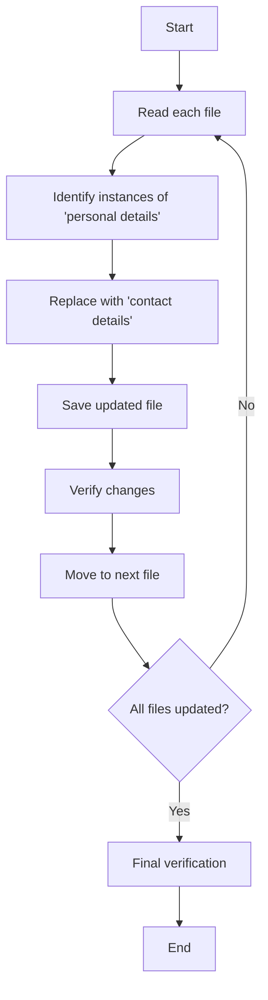
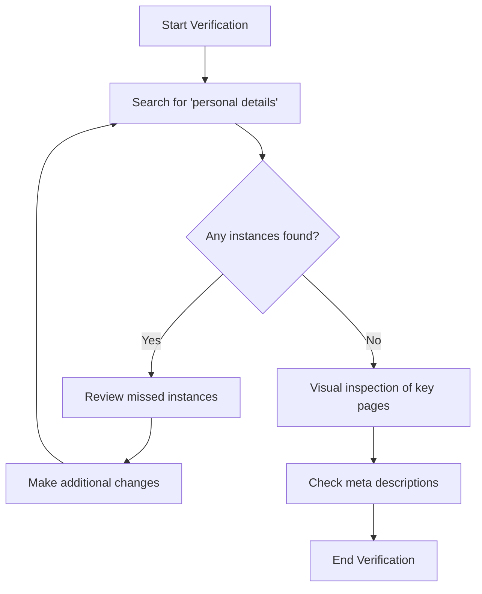

# Plan: Changing "personal details" to "contact details"

## Overview
This document outlines the plan to change all instances of "personal details" to "contact details" across the Hamba Compare website.

## 1. Files Requiring Updates

I've identified 7 files that need to be modified:

1. index.html (3 instances)
2. about.html (3 instances)
3. how-it-works.html (1 instance)
4. privacy-policy.html (1 instance)
5. popi-act.html (1 instance)
6. contact.html (1 instance)
7. hambacompare-website-plan.md (1 instance)

## 2. Specific Changes Required

Here's a breakdown of the exact changes needed in each file:

### index.html
- **Meta description**: Change "Compare insurance quotes from South Africa's leading providers without sharing personal details." to "Compare insurance quotes from South Africa's leading providers without sharing contact details."
- **Privacy Protected card**: Change "Compare insurance quotes without sharing your personal details with multiple providers." to "Compare insurance quotes without sharing your contact details with multiple providers."
- **Footer**: Change "Compare insurance quotes from South Africa's leading providers without sharing personal details." to "Compare insurance quotes from South Africa's leading providers without sharing contact details."

### about.html
- **Meta description**: Change "Learn about Hambacompare's mission to simplify insurance comparison in South Africa without sharing personal details." to "Learn about Hambacompare's mission to simplify insurance comparison in South Africa without sharing contact details."
- **List item**: Change "Sharing personal details with multiple companies" to "Sharing contact details with multiple companies"
- **Footer**: Change "Compare insurance quotes from South Africa's leading providers without sharing personal details." to "Compare insurance quotes from South Africa's leading providers without sharing contact details."

### how-it-works.html, privacy-policy.html, popi-act.html, contact.html
- **Footer**: Change "Compare insurance quotes from South Africa's leading providers without sharing personal details." to "Compare insurance quotes from South Africa's leading providers without sharing contact details."

### hambacompare-website-plan.md
- **Key benefits section**: Change "Compare quotes without sharing personal details" to "Compare quotes without sharing contact details"

## 3. Implementation Approach

The implementation will follow these steps:

1. **Preparation**:
   - Create a backup of all files before making changes (optional but recommended)
   - Prepare a list of all files and the specific locations where changes are needed

2. **Implementation**:
   - For each file, use the `apply_diff` tool to replace "personal details" with "contact details" at the identified locations
   - Ensure proper casing is maintained (e.g., if the original text is "Personal Details", the replacement should be "Contact Details")

3. **Quality Assurance**:
   - After each file is updated, verify that the changes were made correctly
   - Ensure no unintended changes were made

## 4. Verification Strategy

To ensure all changes are made correctly:

1. **Automated Verification**:
   - After all changes are implemented, perform another search for "personal details" across all files to ensure no instances were missed

2. **Manual Verification**:
   - Visually inspect key pages in a browser to ensure the changes appear correctly
   - Check that meta descriptions are updated correctly (these are important for SEO)

## 5. Risks and Considerations

- **SEO Impact**: Changing meta descriptions could potentially impact SEO. However, this is a minor text change that shouldn't significantly affect rankings.
- **Consistency**: Ensure that the change is applied consistently across all instances.
- **Context Appropriateness**: Verify that "contact details" makes sense in all contexts where "personal details" was used.

## 6. Timeline

This is a relatively straightforward task that should take approximately:
- 30 minutes for implementation
- 15 minutes for verification