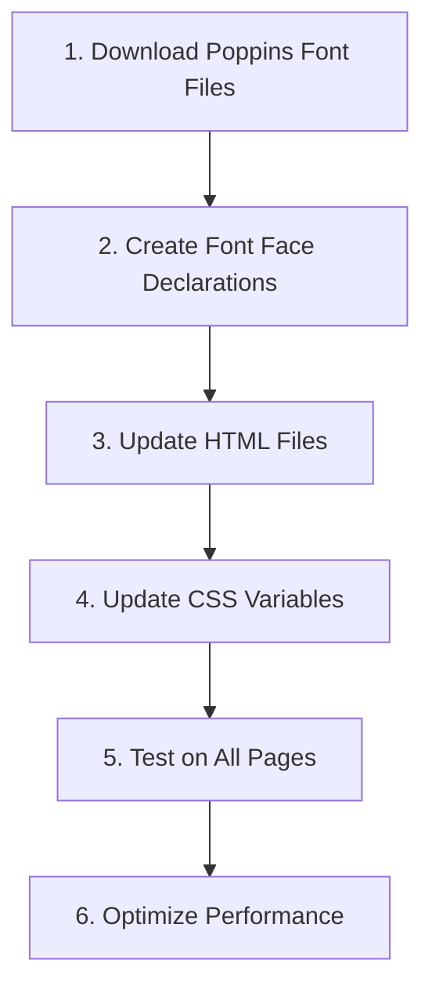

# Poppins Font Implementation Plan

## Current State

- The website currently uses system fonts: `'Segoe UI', Roboto, 'Helvetica Neue', Arial, sans-serif`
- No custom fonts are being loaded (neither via Google Fonts nor local font files)
- The font family is defined in the CSS variables in `styles.css`
- There are 6 HTML files that need to be updated

## Implementation Plan



### 1. Download Poppins Font Files

- Download the Poppins font files (woff2 and woff formats) for the basic set:
  - Regular (400)
  - Medium (500)
  - Bold (700)
- Create the directory structure: `assets/fonts/poppins/`
- Place the font files in this directory

### 2. Create Font Face Declarations

Create `@font-face` declarations in a new CSS file `assets/css/fonts.css`:

```css
/* Poppins Font */
@font-face {
  font-family: 'Poppins';
  src: url('../fonts/poppins/poppins-regular.woff2') format('woff2'),
       url('../fonts/poppins/poppins-regular.woff') format('woff');
  font-weight: 400;
  font-style: normal;
  font-display: swap;
}

@font-face {
  font-family: 'Poppins';
  src: url('../fonts/poppins/poppins-medium.woff2') format('woff2'),
       url('../fonts/poppins/poppins-medium.woff') format('woff');
  font-weight: 500;
  font-style: normal;
  font-display: swap;
}

@font-face {
  font-family: 'Poppins';
  src: url('../fonts/poppins/poppins-bold.woff2') format('woff2'),
       url('../fonts/poppins/poppins-bold.woff') format('woff');
  font-weight: 700;
  font-style: normal;
  font-display: swap;
}
```

### 3. Update HTML Files

Update all 6 HTML files to include:
1. Google Fonts import (as fallback)
2. Link to the new fonts.css file

Add the following to the `<head>` section of each HTML file:

```html
<!-- Google Fonts (Fallback) -->
<link rel="preconnect" href="https://fonts.googleapis.com">
<link rel="preconnect" href="https://fonts.gstatic.com" crossorigin>
<link href="https://fonts.googleapis.com/css2?family=Poppins:wght@400;500;700&display=swap" rel="stylesheet">

<!-- Custom Fonts -->
<link rel="stylesheet" href="assets/css/fonts.css">
```

HTML files to update:
- index.html
- about.html
- contact.html
- how-it-works.html
- popi-act.html
- privacy-policy.html

### 4. Update CSS Variables

Update the font-family variable in `styles.css`:

```css
/* Typography */
--font-family: 'Poppins', -apple-system, BlinkMacSystemFont, 'Segoe UI', Roboto, 'Helvetica Neue', Arial, sans-serif;
```

### 5. Test on All Pages

- Test the website on different browsers and devices
- Verify that the Poppins font is being applied correctly
- Check for any layout issues caused by the font change

### 6. Optimize Performance

- Ensure font files are properly compressed
- Verify that the `font-display: swap` property is working correctly
- Consider adding `preload` for critical font files

## Implementation Sequence

1. First, create the fonts directory and add the font files
2. Create the fonts.css file with @font-face declarations
3. Update the CSS variables in styles.css
4. Update all HTML files to include the new font resources
5. Test and optimize

## Potential Challenges and Solutions

1. **Font Size Adjustments**: Poppins may render differently than the current system fonts, potentially causing layout issues. Solution: Review and adjust font sizes if necessary.

2. **Performance Impact**: Adding font files can impact page load performance. Solution: Use woff2 format (smaller file size) and implement proper font loading strategies.

3. **Cross-Browser Compatibility**: Ensure font rendering is consistent across browsers. Solution: Test on multiple browsers and include appropriate fallbacks.